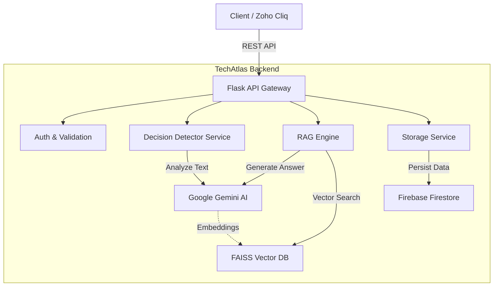

# TechAtlas Backend: Comprehensive Project Overview

## 1. Executive Summary
**TechAtlas Backend** is a production-ready **Decision Intelligence Engine** designed to solve the problem of "Decision Drift" in organizations. It automatically captures, analyzes, and retrieves organizational decisions from chat conversations (like Zoho Cliq) using advanced AI.

By leveraging **Google Gemini AI** for natural language understanding and **RAG (Retrieval-Augmented Generation)** for semantic search, TechAtlas transforms ephemeral chat history into a persistent, searchable knowledge base of organizational decisions.

---

## 2. System Architecture

The system follows a modern, modular microservices-like architecture within a Flask application.

### Core Components
| Component | Technology | Responsibility |
|-----------|------------|----------------|
| **API Gateway** | Flask 3.0 | Handles HTTP requests, routing, and input validation. |
| **AI Engine** | Google Gemini Pro | Performs decision detection and generates natural language answers. |
| **Vector Store** | FAISS | Stores high-dimensional vector embeddings for semantic similarity search. |
| **Document Store** | Firebase Firestore | Stores structured decision data (JSON) for persistence and history. |
| **Embedder** | Gemini Embeddings | Converts text into vector representations for the search engine. |

---

## 3. Key Features & Capabilities

### 🧠 AI Decision Detection
*   **Automatic Analysis**: Scans chat messages to identify decision-making patterns (e.g., "We decided to...", "Let's go with...").
*   **Smart Classification**: Distinguishes between casual conversation and actual commitments.
*   **Confidence Scoring**: Assigns a confidence score (0.0 - 1.0) to every detected decision.

### ⚖️ AI Feasibility Analysis
*   **Automated Review**: Analyzes proposed decisions to identify **Strengths**, **Risks**, and **Alternatives**.
*   **Feasibility Scoring**: Calculates a 0-100 score based on the ratio of benefits to risks.
*   **Historical Context**: Checks similar past decisions to see if they succeeded or failed, adjusting recommendations accordingly.
*   **Actionable Recommendations**: Provides clear advice (e.g., "Proceed with caution", "Reconsider approach").

### 🔍 Semantic Search (RAG)
*   **Natural Language Queries**: Users can ask questions like *"Why did we switch to PostgreSQL?"* instead of keyword matching.
*   **Contextual Answers**: Generates human-readable summaries citing specific decisions as sources.
*   **Source Attribution**: Every answer links back to the original decision and thread.

### 📊 Decision Lifecycle Management
*   **Ownership Tracking**: Assigns an owner to every decision.
*   **Risk Assessment**: Automatically calculates a "Risk Score" based on the number of participants (e.g., single-person decisions = High Risk).
*   **Status Tracking**: Manages states like `Open`, `In Progress`, `Completed`.
*   **Audit Trails**: Logs every creation and modification event.

---

## 4. Technical Stack

### Backend Core
*   **Language**: Python 3.8+
*   **Framework**: Flask 3.0 (Blueprint Architecture)
*   **Server**: Gunicorn (Production WSGI)

### AI & Data
*   **LLM**: Google Gemini Pro (`gemini-1.5-flash` / `gemini-pro`)
*   **Embeddings**: `text-embedding-004`
*   **Vector DB**: FAISS (Facebook AI Similarity Search)
*   **Database**: Google Cloud Firestore (NoSQL)

### Quality Assurance
*   **Testing**: `pytest`, `pytest-cov`, `pytest-mock`
*   **Linting**: `pyright`
*   **CI/CD**: Ready for GitHub Actions

---

## 5. Codebase Structure

The project is organized for scalability and maintainability:

*   `app.py`: Application entry point and global error handling.
*   `config.py`: Centralized configuration using environment variables.
*   `routes/`: API endpoints separated by domain.
    *   `detect.py`: AI detection endpoints.
    *   `save.py`: Decision persistence.
    *   `query.py`: Search and RAG.
*   `services/`: Business logic isolated from HTTP layer.
    *   `detector.py`: Interacts with Gemini API.
    *   `rag_engine.py`: Orchestrates search and answer generation.
    *   `vector_store.py`: Manages FAISS indices.
*   `models/`: Pydantic-style data classes (e.g., `Decision`).
*   `tests/`: Comprehensive test suite (Unit, Integration, E2E).

---

## 6. API Reference

### Core Routes
| Method | Endpoint | Description |
|:---|:---|:---|
| `GET` | `/` | Service information and available endpoints. |
| `GET` | `/health` | Health check for all system components (Firebase, AI, Vector Store). |
| `GET` | `/routes` | List all registered routes (Debug). |
| `GET` | `/version` | API version and build information. |

### Decision Detection & Analysis
| Method | Endpoint | Input | Output |
|:---|:---|:---|:---|
| `POST` | `/detect-decision` | `{ "message": "We decided to use React", "user": "email", "channel_id": "id" }` | `{ "is_decision": true, "confidence": 0.95, "suggested_title": "..." }` |
| `POST` | `/analyze-decision` | `{ "title": "...", "rationale": "...", "context": "..." }` | `{ "analysis": { "strengths": [], "risks": [], "feasibility_score": 85 } }` |

### Decision Management
| Method | Endpoint | Input | Output |
|:---|:---|:---|:---|
| `POST` | `/save-decision` | `{ "title": "...", "owner": "...", "rationale": "...", "due_date": "YYYY-MM-DD" }` | `{ "success": true, "decision_id": "dec_123" }` |
| `GET` | `/decisions` | Query Params: `status`, `owner`, `limit`, `offset` | `{ "decisions": [...], "count": 50 }` |
| `GET` | `/decisions/<id>` | None | `{ "decision": { ... } }` |
| `PUT` | `/decisions/<id>` | `{ "title": "New Title", "status": "In Progress" }` | `{ "success": true, "decision": { ... } }` |
| `DELETE` | `/decisions/<id>` | None | `{ "success": true, "message": "Archived" }` |
| `PATCH` | `/decisions/<id>/status` | `{ "status": "Completed" }` | `{ "success": true, "status": "Completed" }` |
| `GET` | `/decisions/<id>/history` | None | `{ "history": [ { "action": "updated", "timestamp": "..." } ] }` |
| `GET` | `/decisions/<id>/related` | None | `{ "related_decisions": [ { "title": "...", "score": 0.8 } ] }` |
| `POST` | `/search-decisions` | `{ "keyword": "database", "owner": "...", "status": "Open" }` | `{ "decisions": [...] }` |

### Search & RAG
| Method | Endpoint | Input | Output |
|:---|:---|:---|:---|
| `POST` | `/query-decisions` | `{ "query": "Why did we choose React?" }` | `{ "answer": "We chose React because...", "sources": [...] }` |

### Dashboard & Analytics
| Method | Endpoint | Description |
|:---|:---|:---|
| `GET` | `/dashboard/stats` | Overview stats (total, open, completed, high-risk counts). |
| `GET` | `/decisions/high-risk` | List decisions with risk score >= 7. |
| `GET` | `/decisions/recent` | List decisions from the last N days (`?days=30`). |
| `GET` | `/decisions/by-owner/<email>` | List decisions owned by a specific user. |
| `GET` | `/decisions/by-channel/<id>` | List decisions from a specific channel. |
| `GET` | `/decisions/aging` | List past due or unreviewed decisions. |
| `GET` | `/decisions/upcoming-due` | List decisions due in the next N days (`?days_ahead=7`). |
| `GET` | `/analytics/trends` | Decision-making trends over time (`?period=month`). |
| `GET` | `/analytics/topics` | Most discussed decision topics with sentiment analysis. |
| `GET` | `/analytics/velocity` | Average time from decision creation to completion. |

### User Insights
| Method | Endpoint | Description |
|:---|:---|:---|
| `GET` | `/users/<email>` | User profile, participation stats, and expertise areas. |
| `GET` | `/users/top-contributors` | List of most active decision makers. |
| `GET` | `/expertise` | Map of topics to experts based on decision history. |
| `GET` | `/knowledge-gaps` | Identify "knowledge silos" (single-owner decisions). |

### Risk & Audit
| Method | Endpoint | Input | Output |
|:---|:---|:---|:---|
| `POST` | `/assess-risk/<id>` | None | `{ "risk_score": 8, "risk_level": "high", "factors": [...] }` |
| `POST` | `/decisions/reassess-all-risks` | None | `{ "updated_count": 150 }` |
| `GET` | `/audit-logs` | Query Params: `user`, `action_type`, `limit` | `{ "audit_logs": [...] }` |
| `GET` | `/export/decisions` | Query Params: `format=csv/json` | File download (CSV or JSON). |
| `POST` | `/reminders/send` | `{ "decision_id": "...", "recipient_email": "..." }` | `{ "success": true, "reminder_sent_at": "..." }` |

### Development Utilities (Dev Only)
| Method | Endpoint | Input | Output |
|:---|:---|:---|:---|
| `POST` | `/dev/seed-data` | `{ "count": 10 }` | `{ "created_count": 10, "decision_ids": [...] }` |
| `DELETE` | `/dev/clear-data` | None | `{ "deleted_count": 50 }` |
| `POST` | `/dev/validate-embeddings` | `{ "text": "sample text" }` | `{ "embedding_dimension": 768, "sample": [...] }` |
| `GET` | `/dev/stats` | None | `{ "stats": { "total_decisions": 100, ... } }` |

---

## 7. Robustness & Security

*   **Error Handling**: Global exception handlers ensure the API never crashes and always returns valid JSON.
*   **Input Validation**: Strict validation prevents malformed data from entering the system.
*   **Fail-Safe AI**: If the AI service is down, the system degrades gracefully without blocking core operations.
*   **Security**: API keys and credentials are strictly managed via `.env` files and never hardcoded.

## 8. Future Roadmap
*   **Real-time Integration**: Webhooks for Slack/Teams/Zoho Cliq.
*   **User Dashboard**: A frontend for browsing and managing decisions.
*   **Advanced Analytics**: Visualizing decision velocity and risk over time.
